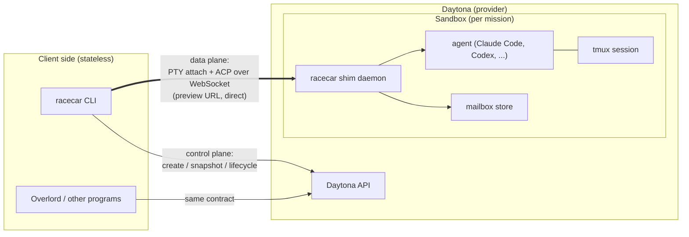

# Racecar

Racecar is an agent-agnostic, launcher-agnostic control plane for cloud coding
sandboxes. It lets a user (or another program) bake a project's environment
into a reusable snapshot, spin up one isolated sandbox per feature branch, run
coding agents inside those sandboxes across multiple sequential prompts, and
communicate with each agent — live through a multiplexed terminal, or
asynchronously through a durable mailbox.

Daytona is the sandbox provider underneath, accessed only through an adapter.
Racecar has no server of its own: the CLI is a stateless client, each sandbox
hosts its own small daemon, and clients talk to sandboxes directly.

Racecar is built to be deeply integrated with [Overlord](https://www.ovld.ai), but it can be used independently.


## Why

Local agent execution gives agents a familiar developer machine but no elastic,
isolated concurrency. Working on several features of one project at once means
several working trees, several process trees, and several agent sessions that
must not interfere. Racecar makes "one sandbox per branch, several branches at
once" cheap:

- **Snapshots** bake the slow, stable parts of a project (toolchain,
  dependencies, agent CLIs) once, so every sandbox starts warm.
- **Sandboxes** are stateful sessions scoped to one feature/mission. A user
  runs multiple objectives sequentially in the same sandbox; the sandbox
  outlives each run.
- **Communication planes** let the user supervise many sandboxes at once
  without babysitting any of them.

Racecar deliberately mirrors the Overlord UX model — repositories, missions
(features), and objectives (prompts within a mission) — but it must be fully
usable from a plain terminal with no Overlord server or credentials. Overlord
integrates as one caller among many, through the `@racecar/gateway` worker
(see [Overlord gateway](#overlord-gateway)).

## Core concepts

| Concept      | Maps to (Overlord) | What it is                                                                 |
| ------------ | ------------------ | -------------------------------------------------------------------------- |
| **Project**  | Repository         | A named repo + environment definition and its immutable snapshot versions. |
| **Snapshot** | —                  | A baked, shareable, credential-free environment image for a project.       |
| **Sandbox**  | Mission / branch   | One stateful, isolated session created from a snapshot. Lives across runs. |
| **Run**      | Objective / prompt | One agent invocation inside a sandbox. Runs execute sequentially.          |
| **Mailbox**  | Chat               | A durable per-sandbox message queue between the user and the agent.        |

Git is the durable source of truth for code. The sandbox filesystem is
recoverable working state, never authoritative.

Mission branches, synchronization, and integration are owned by Racecar while
callers such as Overlord provide intent and consume a small status/resource
contract. See [Git integration for mission sandboxes](planning/git-integration.md)
for the configuration and ownership boundary.

## Architecture



### The sandbox is the server

Racecar keeps no central database. Each sandbox is self-describing: its
project binding, mission metadata, run history, and mailbox live inside the
sandbox and in Daytona labels. The CLI discovers sandboxes by querying Daytona
and talks to each sandbox's shim directly. Daytona *is* the state store; there
is no sync problem between Racecar state and provider state. Callers like
Overlord layer their own durable records on top.

### Two communication planes

**1. PTY multiplex (synchronous).** Every agent runs inside tmux in its
sandbox. `racecar attach <sandbox>` connects your terminal to that tmux
session over Daytona's PTY transport; `racecar ps` lists sessions across
sandboxes. This is ground truth: the full agent UI, interactive logins,
manual shell access. Because tmux owns the process, agents survive client
disconnects and laptop lids.

**2. Mailbox (asynchronous).** A small daemon — the **shim** — runs in every
sandbox and exposes a WebSocket on a Daytona preview URL. It speaks the
[Agent Client Protocol (ACP)](https://agentclientprotocol.com) northbound, so
any ACP client is a Racecar chat client. Messages are durable: the user drops
an instruction and walks away; the agent consumes it at its next decision
point; agent questions and completions queue as items awaiting reply. This is
the plane a mobile client attaches to. Live chat is the degenerate case of the
mailbox when both sides happen to be online.

### Agent adapters (southbound tiers)

Clients only ever see ACP. Inside the shim, agents integrate at one of three
tiers, declared by capability flags on the agent recipe:

1. **Native ACP** — the agent or a maintained adapter speaks ACP directly
   (Claude Code, Codex via `@agentclientprotocol/codex-acp`, Gemini CLI).
   Full mid-run chat, permission requests, streaming.
2. **Bridge** — the agent has a structured streaming interface (e.g.
   `--output-format stream-json`) and Racecar ships a translator.
3. **PTY-only** — the agent is a plain CLI. It still gets the multiplex
   plane; mailbox messages queue and are prepended to the *next* run's prompt
   at the run boundary.

### Credentials

Snapshots are shareable artifacts and must never contain credentials. Worse,
agent OAuth refresh tokens *rotate*: copies of `~/.claude/.credentials.json`
across sandboxes invalidate each other, which manifests as constant re-login
prompts. Racecar therefore treats credentials as first-class per-user objects
injected at sandbox creation:

```bash
racecar setup         # guided: seeds every credential from env, then prompts for the rest
racecar auth claude   # runs `claude setup-token`; stores the 1-year subscription token
racecar auth codex    # Codex device-auth equivalent
racecar auth git      # deploy key / push token
```

`racecar setup` is the one-shot path: it reads `CLAUDE_CODE_OAUTH_TOKEN` and
`GH_AUTH_TOKEN`/`GH_USERNAME` from the environment when present, leaves
credentials already in the store untouched, requests anything still missing
interactively (masked), and finishes by printing `auth list`.

Stored credentials are injected as environment variables (e.g.
`CLAUDE_CODE_OAUTH_TOKEN`) or 0600 files when each sandbox is created. The
long-lived setup-token does not rotate, so N concurrent sandboxes share it
safely, billed against the user's Claude subscription. The PTY plane remains
the escape hatch for anything that genuinely requires an interactive browser
login. Credentials are redacted from events, logs, and diagnostics.

### Lifecycle

Sandboxes follow per-project policy: auto-stop after idle (with an activity
heartbeat while a run is live, so the provider's inactivity timer doesn't kill
a working agent), auto-archive after a retention window, delete after merge or
explicit approval. Container sandboxes are the default class; "resume" of a
stopped container is start-from-preserved-filesystem, never process resume.
A per-project cap bounds concurrent active sandboxes.

### Git integration

Because missions run concurrently in isolated sandboxes, Racecar — not the
caller — owns how a mission branch becomes part of `main`. Each mission owns one
durable branch and pushes frequent checkpoint commits; a per-resource
**integration queue** is the only automated writer to the default branch. The
queue stores immutable entries (an exact `headSha`, never a moving branch
pointer), and the coordinator advances the default branch with a compare-and-swap
`git update-ref` so a concurrent push is detected rather than clobbered. Delivery
and merge are separate states: a mission is _integrated_ only when its delivered
SHA — or a traceable rebased/squashed descendant — lands on the default branch.

A candidate moves `working → delivered → queued → rebasing → testing → merged`,
with `awaiting_approval`, `conflict`, `checks_failed`, and `superseded` exits. On
a conflict or a failed check the candidate is returned to its owning sandbox to
fix and re-enqueue at a fresh head; retries never mutate the failed entry, so the
queue is an append-only audit trail. Policy lives with the project in
`.racecar/config.yaml` (branch naming, checkpoint cadence, merge strategy,
required checks, approval gate).

```bash
racecar integration enqueue --mission coo:252 --head <sha> [--branch <name>] [--resource <key>]
racecar integration status  [--resource <key>] [--mission <id>] [--entry <id>]
racecar integration approve --entry <id>              # awaiting_approval → queued
racecar integration retry   --entry <id> --head <sha> # new entry after conflict/checks_failed
racecar integration dequeue --entry <id>              # cancel (marks superseded)
racecar integration run --once [--resource <key>]     # process one candidate under CAS
```

Every command accepts `--json`, returning a stable `{ ok, resourceKey, state, entry|resource }`
object for gateway/Overlord callers. The full state machine, SHA-identity fields,
immutable-queue semantics, and the minimal contract Racecar exposes to Overlord
are specified in
[Git integration for mission sandboxes](planning/git-integration.md).

### Overlord gateway

`@racecar/gateway` is the long-lived worker that connects a single Overlord
execution target to Racecar. It claims one plain `/api/runner/*` request at a
time, launches it in a Racecar sandbox through the ACP shim, drives the mission
lifecycle with `ovld protocol` on the agent's behalf, and — right after a
successful `deliver` — advances that project's local Git integration queue. It
never reads the Overlord database and never completes an objective itself; the
target is keyed by a stable device fingerprint rather than a bespoke
register/heartbeat contract.

On each claim the gateway resolves a **launch mode**, so a mission need not
always get its own sandbox: `mission-branch` (one sandbox per mission),
`branch` (one shared sandbox per project + branch), or `default-branch` (one
shared sandbox per project). See [docs/gateway.md](docs/gateway.md) for required
inputs, deployment (Railway / Raspberry Pi), and the full launch-mode resolution
order.

## Design principles

- **Overlord-shaped, not generic.** The domain model (project / mission
  sandbox / sequential runs / mailbox) is the product. The only deliberate
  genericity is the sandbox-provider adapter boundary.
- **Stateless control plane, direct data plane.** No Racecar server. Clients
  talk to Daytona for lifecycle and to sandboxes for conversation.
- **ACP northbound, tiered southbound.** One client contract regardless of
  agent.
- **Snapshots are credential-free.** Credentials are injected per sandbox from
  the user's local store.
- **Git is the source of truth.** Sandboxes are disposable; branches are not.

## Stack

TypeScript, Node 24, Yarn (workspaces). Packages:

- `packages/core` — domain model, provider adapter interface, Daytona adapter,
  credential store, quota, reconcile, integration queue, security/firewall.
- `packages/cli` — the `racecar` binary (project, snapshot, sandbox, run, chat,
  attach, msg/inbox, integration, auth, reconcile, audit, quota).
- `packages/shim` — the in-sandbox daemon (ACP server, agent adapters,
  mailbox, run/git servers), shipped into snapshots.
- `packages/gateway` — the long-lived Overlord execution worker (see
  [Overlord gateway](#overlord-gateway)).

## Status

Implemented and under active development. All four packages exist with test
coverage across `vitest`; the `racecar` CLI surface described above is built.
The staged build sequence lives in
[planning/implementation-plan.md](planning/implementation-plan.md); the earlier
exploration in [planning/overlord-useage.md](planning/overlord-useage.md)
records the design this supersedes.
