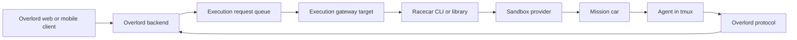

# Racecar–Overlord Execution Gateway Architecture

## Status

> **⚠️ Partially superseded by
> [`gateway-runner-reuse.md`](gateway-runner-reuse.md).** The
> registration/claim/health mechanism this document assumes — the gateway
> registering and heartbeating as a bespoke Overlord execution target over the
> `/api/virtual-targets/v1/*` surface, and reporting claim/launch/failure and
> health states through it — **was never built server-side** (only DTOs and
> unused DB migrations landed in Overlord, commit `93dd8a1a`, contract v3). The
> gateway is now an always-on **plain Overlord local runner**: it self-provisions
> via an ordinary `USER_TOKEN` + stable device fingerprint, claims work through
> the already-built `POST /api/runner/claim` / `.../launching` / `.../launched` /
> `.../failed` lifecycle, drives the mission with `ovld protocol *`, and connects
> to each sandbox's ACP shim instead of spawning a launch command. Treat sections
> tagged **[Superseded]** below as historical.
>
> **Still correct and retained:** the domain model — one car per Overlord
> mission, one run per objective, the identity mapping, multi-resource project
> handling, the terminal architecture (one tmux session in the car), the
> Git/repository ownership boundaries, and the security boundaries. Those are
> unchanged; `gateway-runner-reuse.md` builds directly on them.

Proposed architecture for integrating Racecar with Overlord while preserving
Racecar as an independently usable, backend-free CLI and library.

The provider-neutral target and runner queue boundary is specified separately in
[`virtual-execution-target.md`](virtual-execution-target.md). This document applies
that contract to the Racecar gateway and sandbox lifecycle.

## Summary

Overlord should treat a remote execution gateway as a normal execution target.
The gateway claims Overlord execution requests and delegates sandbox operations
to an installed Racecar CLI or Racecar library. Racecar remains responsible for
projects, snapshots, mission cars, runs, and provider communication. It does not
need its own database or cloud control plane.

One Racecar car is created per Overlord mission and reused for that mission's
sequential objectives. Each objective becomes one Racecar run. The car owns the
only persistent tmux session. Local CLI clients and browser terminals attach to
that same tmux session through different transports; the gateway must not wrap
it in another tmux session.

This architecture supports three deployment modes without changing Racecar's
domain model:

1. Direct CLI: a user runs Racecar locally without Overlord.
2. Local Overlord: an Overlord runner invokes Racecar on the user's workstation.
3. Remote Overlord: an always-online execution gateway invokes Racecar for
   requests submitted from any Overlord client, including a phone while the
   user's laptop is offline.

The local and remote modes use the same gateway protocol and Racecar adapter.
They differ only in availability, packaging, and which repository source modes
they can satisfy:

| Target | Gateway location | Works while laptop is offline | Repository source |
| --- | --- | --- | --- |
| `device.local:racecar` | User workstation | No | Local checkout or Git remote |
| User-named remote Racecar target | Railway, Raspberry Pi, VPS, or home server | Yes | Git remote |

`device.local:racecar` is a Racecar-capable execution target advertised by the
local device. It may coexist with the device's ordinary local execution target;
it is not a car and does not identify one sandbox.

## Goals

- Keep Racecar independently useful from a normal terminal.
- Avoid adding a Racecar database or Racecar-hosted control plane.
- Let Overlord launch an objective in Racecar through its normal execution-target
  and execution-request model.
- Permit mobile launches while the user's laptop is offline.
- Reuse one stateful car across sequential objectives in one mission.
- Keep sandbox-provider details out of Overlord.
- Keep Overlord-specific orchestration out of Racecar core.
- Preserve direct, interactive access to the agent's tmux session.
- Make all automated gateway operations idempotent and machine-readable.
- Keep Git as the durable source of truth for code.

## Non-goals

- Racecar does not become the system of record for Overlord missions or
  objectives.
- Overlord does not directly manage Daytona or another sandbox provider.
- A car is not represented as a separate Overlord execution target.
- The gateway does not host agent processes or persistent per-car tmux sessions.
- Snapshots must not contain Git, agent, Overlord, or provider credentials.
- The first version does not require direct browser-to-provider terminal access.

## Components

### 1. Overlord

Overlord owns:

- Projects, missions, objectives, and execution requests.
- Execution-target selection and request queueing.
- Desired repository, branch, and base-branch state.
- Agent, model, reasoning, flags, and pre-command selection.
- Durable objective and mission state.
- Authorization, audit history, and protocol sessions.

Overlord sees the gateway as one stable execution target. It does not need to
know how many Racecar cars exist behind that target.

### 2. Execution gateway

The gateway is an always-online process running on a Raspberry Pi, VPS, home
server, managed worker, or similar host. It owns:

> **[Superseded — registration/heartbeat]** "Registration and heartbeat as an
> Overlord execution target" is replaced by plain runner self-provisioning: the
> gateway simply authenticates with a `USER_TOKEN` + stable device fingerprint,
> and `ensureActingDeviceTarget` creates/reuses its target on first call. There
> is no bespoke registration or heartbeat endpoint to call. Liveness/wake-up is
> handled via `GET /api/runner/status?projectId=X`. See
> [`gateway-runner-reuse.md`](gateway-runner-reuse.md).

- Registration and heartbeat as an Overlord execution target.
- Claiming execution requests assigned to that target.
- Holding Racecar/provider credentials and authorized Git credential references.
- Translating Overlord requests into Racecar operations.
- Reporting request launch, failure, and checkout observations to Overlord.
- Proxying interactive terminal connections when required.
- Running provider-neutral health checks.

The gateway is not a Racecar server. It is an automated Racecar client and may
eventually support other execution adapters.

The supported self-hosting product should be one small gateway distribution,
packaged in two reference templates:

- a container deployment for Railway with health checks, restart policy,
  environment-variable configuration, and an optional persistent volume for
  cache and local configuration; and
- a Raspberry Pi deployment using the same multi-architecture container, with
  Docker Compose plus a service definition for automatic restart.

Both templates register the gateway with Overlord, run Racecar, and call the
configured sandbox provider. They do not host cars, Git repositories, or an
Overlord database. A provider-free Raspberry Pi mode that runs cars directly on
the Pi would be a separate future execution adapter, not part of this gateway.

### 3. Racecar

Racecar remains a standalone CLI and reusable library. It owns:

- Racecar project definitions.
- Snapshot creation and compatibility checks.
- Car creation, discovery, start, stop, archive, and deletion.
- Repository materialization inside a car.
- Agent runs inside the car.
- Provider adapters and provider API communication.
- Connecting a terminal client to the car's tmux session.
- Recoverable car identity stored in provider labels.

Racecar does not persist Overlord's mission or objective state.

### 4. Sandbox provider

The provider, initially Daytona, owns sandbox compute, snapshots, PTY transport,
networking, and lifecycle primitives. Provider SDK types remain behind Racecar's
provider adapter.

## Identity mapping

| Overlord concept | Racecar concept | Lifetime |
| --- | --- | --- |
| Execution gateway target | Racecar installation/provider credential boundary | Stable |
| Project resource | Racecar project repository | Project |
| Environment version | Racecar snapshot | Immutable/versioned |
| Mission | Car/sandbox | Mission |
| Objective execution request | Run | Objective invocation |
| Mission branch | Branch checked out in the car | Mission branch cycle |

The execution gateway is the only Overlord execution target in this mapping.
Cars are ephemeral children managed behind it.

## High-level topology



If the user's laptop is offline, the gateway remains available to claim the
request. If no gateway is online, Overlord leaves the request queued and reports
that it is waiting for its execution target.

## Execution flow

> **[Superseded — wire mechanism only]** The sequence of *what happens* (claim →
> resolve resources → ensure project/snapshot/car → check out branch → mark
> launching → start run → mark launched → agent attaches → delivery) is retained,
> but the transport changes: claim and the launching/launched transitions ride
> the plain `/api/runner/*` lifecycle, and "the agent attaches directly to
> Overlord" is now done **by the gateway on the mission's behalf** via `ovld
> protocol attach`/`update`/`deliver` over the sandbox's ACP shim connection —
> the sandbox has no installed Overlord connector of its own. See
> [`gateway-runner-reuse.md`](gateway-runner-reuse.md), "Driving the mission
> lifecycle remotely."

1. The user selects the gateway execution target and launches an objective.
2. Overlord creates its normal durable execution request.
3. The gateway claims the request for its execution target.
4. The gateway resolves all Overlord project resources, their desired branch
   states, and the objective's initially active resource.
5. The gateway calls Racecar to ensure the Racecar project exists.
6. Racecar ensures a compatible snapshot exists, building one when necessary.
7. Racecar discovers or creates the mission car using stable external IDs.
8. Racecar fetches and checks out the branch requested by Overlord.
9. Racecar returns the observed branch, commit, workspace, and car identity.
10. The gateway acknowledges branch preparation and marks the request launching.
11. The gateway starts a Racecar run for the objective.
12. Racecar launches the selected agent in the car's tmux session.
13. The gateway marks the execution request launched.
14. The agent attaches directly to Overlord using the execution-request context.
15. The agent uses the normal Overlord protocol through delivery.
16. Racecar stops, retains, archives, or deletes the car according to policy.

Provisioning success and agent attachment are distinct. A successful provider
operation must not be treated as a durable agent session until the agent attaches
to Overlord. Existing Overlord stale-launch expiry remains authoritative.

## Desired state and observed state

Overlord owns branch intent. Racecar owns the Git operations that realize it.

Overlord provides:

```ts
interface DesiredCheckout {
  resourceKey: string;
  repositoryUrl: string;
  branch: string;
  baseBranch: string;
  commit?: string;
  createIfMissing: boolean;
}
```

Racecar returns:

```ts
interface CheckoutObservation {
  resourceKey: string;
  branch: string;
  commit: string;
  dirty: boolean;
  carId: string;
  workspaceDir: string;
}
```

Racecar must not silently invent a different mission branch. If it cannot
realize the requested checkout safely, it returns a typed failure.

Projects may contain multiple repository resources. A launch supplies one
`DesiredCheckout` per resource plus the initially active resource key. Racecar
returns one `CheckoutObservation` per resource. Resource keys are stable identity;
repository basenames and workspace directory names are not.

## Gateway-to-Racecar contract

The gateway may initially invoke Racecar as a subprocess. Racecar should expose
the same operations through a reusable TypeScript API so the gateway can later
embed the library without changing behavior.

The automated interface must have these properties:

- Non-interactive operation.
- Structured NDJSON or JSON output.
- Stable event names and typed error codes.
- Idempotent ensure operations.
- Caller-supplied external IDs.
- Safe concurrent CLI invocation.
- Explicit state/config directory.
- No parsing of human-readable output.
- No secrets in arguments, output, labels, or build logs.

Illustrative commands:

```bash
racecar --json project ensure \
  --external-id <overlord-project-id> \
  --name <project-name> \
  --repo <repository-url> \
  --default-branch <branch>

racecar --json snapshot ensure \
  --project <overlord-project-id> \
  --fingerprint <environment-fingerprint>

racecar --json car ensure \
  --project <overlord-project-id> \
  --external-id <overlord-mission-id> \
  --branch <mission-branch> \
  --base-branch <base-branch>

racecar --json run start \
  --car <car-id> \
  --external-id <execution-request-id> \
  --agent <agent-key> \
  --prompt-file <path>
```

Exact command names are not normative here. The behavior and structured
contract are.

## Launch envelope

The gateway should translate an Overlord request into a provider-neutral Racecar
input rather than passing an entire Overlord DTO:

```ts
interface RacecarLaunchInput {
  externalRequestId: string;
  externalProjectId: string;
  externalMissionId: string;
  externalObjectiveId: string;

  instruction: string;
  checkouts: DesiredCheckout[];
  activeResourceKey: string;

  agent: {
    key: string;
    model?: string;
    reasoningEffort?: string;
    flags: string[];
    preCommand?: string;
  };

  environment: {
    profile: string;
    snapshotFingerprint: string;
  };

  runtimeEnv: Record<string, string>;
  credentialRefs: string[];
}
```

Expected runtime environment includes:

```text
OVERLORD_BACKEND_URL
OVERLORD_MISSION_ID
OVERLORD_OBJECTIVE_ID
OVERLORD_EXECUTION_REQUEST_ID
OVERLORD_PROJECT_RESOURCES
OVERLORD_IN_POD=1
```

The Overlord credential should be short-lived and scoped to the mission or
execution request. The gateway's long-lived user credential must not be copied
into a car.

## Racecar state and recovery

Racecar does not need a database. Local state may contain configuration and
caches, but provider labels must be sufficient to rediscover managed cars.

The gateway must set an explicit Racecar state root rather than relying on its
current working directory:

```text
RACECAR_HOME=~/.racecar/gateways/<overlord-target-id>
```

Local state may cache:

- Overlord project ID to Racecar project mapping.
- Snapshot names and fingerprints.
- Environment defaults.
- Credential references, never raw credentials when avoidable.

Provider labels should include stable, versioned identity:

```text
racecar.managed=true
racecar.schema-version=<version>
racecar.project=<racecar-project-id>
racecar.mission=<external-mission-id>
racecar.branch=<branch>
racecar.snapshot=<snapshot-name>
racecar.created-by=overlord
overlord.target=<execution-target-id>
overlord.project=<project-id>
```

If local Racecar state is lost, the gateway must be able to rediscover cars from
provider labels. Labels must never contain secrets or full objective prompts.

## Repository and first snapshot preparation

Snapshot preparation is a project operation, not part of the agent's objective.
The first execution request may wait for it, but build state and failures should
be reported separately from the run.

### Repository source policy

Racecar gateways are not Git hosting or repository-mirroring services. A Git
host is the canonical durable code source for an always-online target. The
gateway stores repository configuration and credential references, and may use
temporary clones or bounded caches, but it must not become the only durable copy
of source or mission output.

Source selection is independent of execution-target selection:

```ts
type ProjectSource =
  | { resourceKey: string; kind: 'git'; url: string; revision: string; credentialRef?: string }
  | { resourceKey: string; kind: 'local_checkout'; path: string; observedCommit?: string }
  | { resourceKey: string; kind: 'archive'; path: string; digest: string };
```

- Remote targets accept `git`. GitHub, GitLab, Bitbucket, and self-hosted Git
  servers are equivalent at this boundary.
- `device.local:racecar` accepts `local_checkout` and `git`. A local checkout is
  converted to a filtered, digest-addressed archive when provider upload is
  needed, so uncommitted or unpushed work can be used intentionally.
- An archive is transport, not a new system of record. Mission branches and
  checkpoint commits must be pushed to a configured Git remote before they are
  considered durable or eligible for integration.
- If a project has no writable Git remote, Racecar may run it locally but must
  clearly report that offline recovery and automated integration are unavailable.

Snapshots describe reusable environments, not repository state. Their
fingerprints may use lockfiles and declared environment inputs from the selected
source, but snapshots should not contain the working repository or credentials.
Every mission car materializes current code after it starts.

### Repository views for browsing and mentions

Overlord features such as `MentionableTextArea` need a browsable repository, but
they must not assume that every execution target has a permanent mutable working
directory. Each Racecar target instead exposes a revision-aware repository view:

- A remote gateway maintains a cached bare mirror plus disposable, read-only
  worktrees pinned to observed commits.
- `device.local:racecar` may expose the local checkout, including its dirty state,
  or a Git-backed view.
- A repository view is a browsing and indexing surface, not a durable source of
  truth and not the mission car's working tree.
- A draft retains the observed revision and relevant content hashes. Refreshing a
  gateway cache must not silently rewrite the source context captured by the
  draft.

Repository mentions are not automatically requirements for byte-identical source.
Most mentions are navigation hints that the agent should resolve against the
source it actually receives. The launch contract distinguishes two forms:

```ts
type InformationalReference = {
  resourceKey: string;
  path: string;
  observedRevision?: string;
  observedContentHash?: string;
  excerpt?: string;
};

type SourceRequirement =
  | { resourceKey: string; kind: 'path_exists'; path: string }
  | { resourceKey: string; kind: 'revision_contains'; revision: string }
  | { resourceKey: string; kind: 'content_hash'; path: string; hash: string }
  | { resourceKey: string; kind: 'source_bundle'; bundleId: string };
```

Informational references carry their original excerpts in the objective payload.
At launch, the selected target reports whether each file was found unchanged,
found but changed, missing, or likely renamed. Drift adds context for the agent
and does not block by itself.

Source requirements express code that must be present to perform the objective.
An unsatisfied requirement blocks launch unless the user explicitly overrides it.
Overlord should infer requirements conservatively rather than ask users to label
every mention:

- Phrases such as "look at," "related to," and "similar to" usually indicate
  informational references.
- Phrases such as "continue these changes," "the new module," and "this
  implementation" suggest source requirements.
- A newly created local path, a local-only feature area, a requested branch that
  is not reachable remotely, or attached context naming absent symbols strongly
  suggests a source requirement.

When the selected target changes, the gateway performs a preflight across paths,
directories, named symbols, routes, tables, feature-branch reachability, and the
local diff that informed the objective. It returns:

```ts
type SourceCompatibility = {
  status: 'compatible' | 'degraded' | 'incompatible';
  resources: Record<string, {
    matchedPaths: string[];
    changedPaths: string[];
    missingPaths: string[];
    missingSymbols: string[];
  }>;
};
```

`compatible` launches normally. `degraded` launches with the drift report and
mention excerpts included for the agent. `incompatible` requires committing and
pushing, selecting the local target, uploading a filtered source bundle while the
local device is available, or an explicit override. A stale individual file is
usually degraded; absence of the feature area required by the objective is
incompatible.

### Multi-resource projects and mission navigation

A Racecar project represents the complete Overlord project resource set, not just
the resource active when a mission starts. The environment snapshot is prepared
from the declared environment inputs and lockfiles of every associated resource.
Repository source is still materialized after car startup; "the snapshot includes
all resources" means that all resource environments and required tooling are
prepared, not that mutable repository contents are baked into the snapshot.

Each car uses a deterministic workspace layout such as:

```text
/workspace/resources/<resource-key>/
```

The car materializes and observes every project resource before the first run.
The initially active resource controls the run's working directory, but an agent
may inspect or switch to any other resource without creating a new car. Mentions,
source requirements, checkout observations, Git branches, checkpoints, and
integration state are always qualified by `resourceKey`.

The snapshot fingerprint covers the ordered set of resource keys and each
resource's environment inputs. Adding, removing, or changing an environment-
relevant resource produces a new fingerprint. A mission can continue using its
existing car only when that car's snapshot is compatible with the current project
resource set; otherwise Racecar reports `environment_incompatible` and rebuilds or
requires an explicit migration. Merely changing the active resource does not
invalidate the car.

The governing rule is: repository drift is acceptable while references remain
useful navigation context. It is not acceptable when the selected source lacks
code required to understand or perform the objective.

### Git-accessible repository

1. The gateway supplies repository URL, revision, and a Git credential reference.
2. Racecar creates a temporary snapshot-builder sandbox.
3. Racecar injects short-lived Git credentials at runtime.
4. Racecar clones the selected base revision.
5. Racecar runs declared environment setup and dependency installation steps.
6. Racecar removes credentials and credential-bearing files.
7. Racecar creates the immutable snapshot.
8. Racecar records its environment fingerprint.
9. Mission cars created from the snapshot still fetch and check out current code.

### Local-only or unpushed repository

Racecar should accept a provider-neutral source archive:

```ts
type MaterializedProjectSource =
  | { resourceKey: string; kind: 'git'; url: string; revision: string; credentialRef?: string }
  | { resourceKey: string; kind: 'archive'; path: string; digest: string };
```

The component with access to the source checkout creates the archive, applying
Git ignore rules, `.overlordignore`, and explicit secret exclusions. Racecar
uploads it as a temporary build context, verifies its digest, builds the
snapshot, and deletes the temporary source.

### Snapshot fingerprint

A snapshot fingerprint should include stable environment inputs:

```text
hash(
  environment profile version
  + ordered project resource keys
  + per-resource environment definitions
  + base image
  + setup commands
  + agent tool versions
  + package manager
  + dependency lockfile hashes by resource key
  + explicitly declared environment files
)
```

Do not include the current source commit unless source code is intentionally
baked into the snapshot. Code freshness and environment freshness are separate.

## Terminal architecture

There is exactly one persistent tmux session: the session inside the car.

### Direct Racecar CLI

```text
local terminal
  -> Racecar client
  -> provider PTY transport
  -> tmux inside car
```

`racecar attach <car>` bridges local stdin, stdout, resize, and detach semantics
to the provider PTY. Disconnecting the client must not kill tmux or the agent.

### Overlord browser terminal

```text
browser terminal
  -> authenticated WebSocket
  -> execution gateway terminal proxy
  -> provider PTY transport
  -> tmux inside car
```

The gateway forwards terminal bytes and resize events. It must not create an
outer tmux session. Overlord authorization controls who may open the terminal,
and provider credentials never reach the browser.

The terminal proxy protocol needs only:

- Open/authorized.
- Input bytes.
- Output bytes.
- Resize columns and rows.
- Detach.
- Exit/error status.

Direct browser-to-provider access may be added later behind a capability using
short-lived provider credentials. It is not required for the initial design.

## Direct and remote Racecar interoperability

Cars created by the gateway remain normal Racecar-managed cars. An authorized
user can discover and attach to them with a local Racecar CLI:

```bash
racecar ps
racecar attach <car-id>
racecar runs <car-id>
```

The local CLI should connect directly to the provider rather than SSH into the
gateway. Users may authenticate with their own provider credentials or receive a
short-lived connection descriptor from the gateway.

Concurrent clients may attach to the same tmux session, but Racecar must enforce
at most one active run per car unless a later explicit concurrency mode is added.

## Health and availability

> **[Superseded — health-state surface]** The health states below
> (`ready`/`degraded`/`waiting_for_gateway`/`configuration_error`/
> `provider_unavailable`) were meant to be reported over the bespoke
> virtual-target health surface, which was never built. There is no
> Overlord-side health/heartbeat endpoint for the plain runner; the gateway's
> own always-on loop uses `GET /api/runner/status?projectId=X` to notice queued
> work and wake stopped sandboxes. These states may still be useful as
> gateway-internal diagnostics, but they are not an Overlord wire contract. See
> [`gateway-runner-reuse.md`](gateway-runner-reuse.md), "Waking a stopped
> sandbox."

The gateway reports both host reachability and adapter health. Suggested states:

- `ready`: gateway, Racecar, credentials, and provider are usable.
- `degraded`: gateway is online but one optional capability is unavailable.
- `waiting_for_gateway`: no process can currently claim target requests.
- `configuration_error`: missing or invalid credentials/configuration.
- `provider_unavailable`: Racecar cannot reach the sandbox provider.

A Racecar adapter health probe should verify:

- Compatible Racecar version.
- Provider credentials.
- Provider connectivity.
- Required agent credentials or credential references.
- Supported agents.
- Snapshot and PTY capabilities.

Already-running cars may continue operating if the gateway becomes unavailable.
New provisioning, lifecycle commands, and gateway-proxied terminal sessions will
not be available until a gateway reconnects. Agents inside cars continue to talk
directly to Overlord.

## Failure and idempotency requirements

- Project ensure is idempotent by external project ID.
- Snapshot ensure is idempotent by project and fingerprint.
- Car ensure is idempotent by project and external mission ID.
- Run start is idempotent by external execution-request ID.
- A retry must return the existing resource or run instead of duplicating it.
- Partial car creation must remain discoverable and cleanable.
- Typed errors must distinguish configuration, authentication, provider,
  checkout, snapshot-build, car-lifecycle, run-busy, and launch failures.
- Gateway crashes must not kill the car or its tmux session.
- Stale Overlord claims remain governed by Overlord's execution-request recovery.

## Security boundaries

- Provider and Git credentials live on the gateway or in an approved secret
  store, not in Overlord launch flags.
- Cars receive only the credentials required for that car and run.
- Overlord tokens injected into cars are short-lived and narrowly scoped.
- Snapshot builds must prove that credentials are absent before publication.
- Secrets must be redacted from command output, structured events, labels,
  diagnostics, and terminal metadata.
- Browser terminal access is authorized by Overlord and uses an expiring session.
- Destructive lifecycle and Git actions require explicit permissions and audit
  records.

## Overlord configuration experience

At project level, users select an execution target and environment profile:

```text
Execution target: Racecar Gateway
Repository: github.com/example/project
Environment: Default Node environment
Mission isolation: One car per mission
Lifecycle: Stop after 30 minutes; retain until merged
```

The mission Git panel continues to select the desired branch and base branch. It
may display the associated car state and actions such as Open terminal and Stop.

Agent, model, reasoning, pre-command, and flags remain agent launch settings.
Snapshot and provider configuration must not be encoded as agent flags or
pre-commands.

On first launch, Overlord may display Racecar preparation stages:

```text
Repository connected
Building reusable environment
Creating mission car
Checking out mission branch
Launching agent
```

## Overlord contract impact

> **[Superseded]** The premise of this section — that the architecture requires
> new Overlord Runner/REST/Database/UI contract work (a new execution-target
> capability, gateway registration/health semantics, a runner-side execution
> adapter boundary) — no longer holds. `gateway-runner-reuse.md` requires **zero
> Overlord-side changes**: it reuses the already-built device self-provisioning
> and `/api/runner/*` claim lifecycle. If the implementation plan finds something
> that seems to need an Overlord-side change, that is a blocker to flag, not
> scope to build here. See [`gateway-runner-reuse.md`](gateway-runner-reuse.md),
> "Explicit non-goals for this plan."

Implementing this architecture crosses Overlord's Runner, REST, Database, and UI
boundaries and must be specified in Overlord's component contract before code is
added. Expected contract work includes:

- A provider-neutral provisioned or virtual execution-target capability.
- Gateway registration and health semantics.
- Target-relative Git repository resources rather than requiring a pre-existing
  local directory.
- Provider-neutral mission environment identity and observations.
- A runner-side execution adapter boundary.
- Terminal-session authorization and proxy transport if browser terminal access
  is included.

Racecar should integrate only through documented Overlord REST, queue, and
protocol surfaces. It must not access Overlord's database directly.

## Recommended delivery sequence

> **[Superseded — step 5]** "Define the Overlord virtual-target and gateway
> contract" is dropped: there is no new Overlord contract to define. The
> equivalent step is now "pin a stable device fingerprint and stand up the plain
> runner claim loop," per [`gateway-runner-reuse.md`](gateway-runner-reuse.md).
> The remaining steps (Racecar CLI contract, snapshot/car/run ensure operations,
> terminal proxying, hardening) still apply.

1. Stabilize Racecar's machine-readable, non-interactive CLI contract.
2. Add explicit Racecar state-root configuration and external IDs.
3. Make provider-label discovery sufficient for recovery.
4. Add idempotent project, snapshot, car, and run ensure operations.
5. Define the Overlord virtual-target and gateway contract.
6. Implement a gateway Racecar subprocess adapter.
7. Launch one objective into one mission car and verify normal Overlord attach
   and delivery.
8. Reuse the car for sequential objectives in the same mission.
9. Add repository/snapshot preparation and compatibility fingerprints.
10. Add browser terminal proxying to the car's existing tmux session.
11. Add lifecycle, Git mutation, observability, and recovery hardening.
12. Publish the Railway and Raspberry Pi templates from the same versioned,
    multi-architecture gateway image and verify upgrade/rollback instructions.

## Architectural decisions

1. Racecar remains backend-free; the gateway is an automated client.
2. Overlord sees one gateway target, not one target per car.
3. One mission maps to one reusable car.
4. One objective execution request maps to one Racecar run.
5. Overlord owns desired branch state; Racecar realizes and observes it.
6. The car owns the only persistent tmux session.
7. Browser terminals proxy to the car; the gateway does not nest tmux.
8. Direct Racecar CLI access remains supported for gateway-created cars.
9. Overlord is the durable orchestration system of record; Git is the durable
   code system of record.
10. Provider-specific behavior remains behind Racecar's provider adapter.
11. Remote gateways use Git hosts as the durable repository source; they do not
    operate a hidden repository store.
12. Local checkout support belongs to `device.local:racecar` and is transported
    as a filtered archive when the sandbox provider cannot access the checkout.
