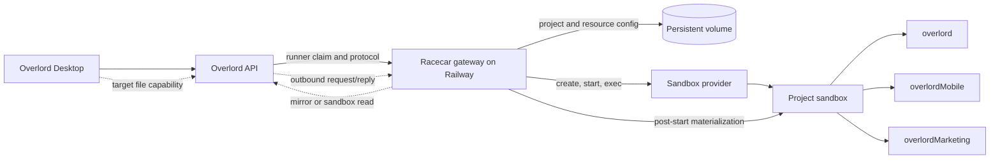

# Racecar–Overlord resource gateway implementation plan

## Status

- **Mission:** `coo:426`
- **State:** proposed implementation sequence
- **Contract baseline:** Overlord contract v27, reviewed 2026-07-24
- **Primary repositories:** Racecar and Overlord

This plan turns the gateway UX review into an executable build sequence. It
supersedes the virtual-target direction for this feature, but does not replace
the broader product roadmap in
[`post-v1-overlord-racecar-plan.md`](post-v1-overlord-racecar-plan.md).

The implementation should preserve the existing gateway-runner reuse decision:
a deployed Racecar gateway is an ordinary, device-backed Overlord execution
target. The target represents one gateway/provider boundary and may serve many
Racecar and Overlord projects.

## Outcome

An operator can deploy the gateway on Railway, register it from the gateway
terminal, connect a Racecar project to an Overlord project, add multiple Git
repositories as keyed resources, and synchronize their deterministic sandbox
paths with Overlord.

After selecting the gateway execution target in Overlord Desktop:

- each connected resource can be selected as the objective working resource;
- an agent launched into a resource receives all project-resource context;
- writable and read-only resources are enforced consistently;
- the sandbox contains every configured repository at a stable path; and
- remote file mentions, browsing, search, and observations eventually use the
  selected target instead of the Desktop host filesystem.

Automatic Git merging and multi-repository integration are explicitly out of
scope.

## Target operator experience

```bash
# Once per Railway gateway deployment
racecar gateway register \
  --name "Racecar Railway" \
  --workspace <overlord-workspace-id>
racecar gateway doctor

# Once per logical project
racecar project connect \
  --name Overlord \
  --overlord-project <id-or-name>

racecar resource add overlord \
  --project Overlord \
  --git https://github.com/cooperativ-labs/Overlord.git \
  --branch main \
  --primary \
  --access rw

racecar resource add overlordMobile \
  --project Overlord \
  --git https://github.com/example/overlordMobile.git \
  --branch main \
  --access rw

racecar resource add overlordMarketing \
  --project Overlord \
  --git https://github.com/example/overlordMarketing.git \
  --branch main \
  --access rw

racecar project sync --project Overlord
racecar project status --project Overlord
```

`project connect --create` may be added as a convenience for creating the
Overlord project. It must compose existing Overlord operations rather than add a
second project model to the gateway.

## Product and architecture decisions

### 1. Reuse the ordinary execution-target model

The gateway continues to poll the standard `/api/runner/*` surface with an
ordinary bearer token and a stable device fingerprint. Registration wraps the
standard standalone target command:

```bash
ovld add-et --name <name> --workspace-id <workspace-id>
```

Racecar must not restore the retired `/api/virtual-targets/*` design. The
gateway is one computer from Overlord's perspective, even though Racecar
realizes its files inside disposable sandboxes.

### 2. Keep one identity for each logical resource

The `resourceKey` is the join key across both systems. Do not derive identity
from a repository basename or path.

| Owner | Data |
| --- | --- |
| Overlord | project ID, resource key, label, primary/current flags, access mode, objective binding, selected execution target |
| Racecar | secret-free Git URL, default revision, environment profile, provider configuration, sandbox materialization |
| Shared join | `(overlordProjectId, resourceKey, executionTargetId)` |

Racecar resource keys must exactly match their Overlord resource keys. A sync
must fail with a useful reconciliation report on duplicates, unsafe path
segments, mismatched primaries, or incompatible access modes.

### 3. Separate sandbox paths from gateway control paths

The current `workspaceDir` field is overloaded. It denotes a path inside the
Daytona sandbox, but the gateway also tries to use it as a Railway-host path
when preparing Git mirrors and protocol checkpoints.

Replace that ambiguity with two explicit path concepts:

```ts
interface ProjectResource {
  key: string;
  label: string;
  gitUrl: string; // secret-free
  defaultBranch: string;
  accessMode: 'read_write' | 'read';
  primary: boolean;
  sandboxPath: string;
  controlMirrorPath: string;
}
```

Conventions:

- sandbox path: `/workspace/<project-key>/<resource-key>`;
- persistent gateway mirror:
  `/data/racecar/mirrors/<project-key>/<resource-key>.git`;
- request checkpoint worktree:
  `/data/racecar/checkpoints/<request-id>/<resource-key>`;
- all persisted paths are derived through one tested path service;
- no sandbox path may be opened directly on the Railway host; and
- no gateway-state path is passed to an in-sandbox agent as its working
  directory.

Exact roots remain configurable, but the distinction is not configurable.

### 4. Snapshots contain environments, not repositories

The current snapshot builder clones each repository while building the provider
image. That occurs before runtime Git credentials are injected and makes
private repositories unsafe or unusable.

Snapshots should contain only the operating system, tools, agent adapters, and
dependency caches that are safe to persist. After sandbox startup, Racecar
materializes every project resource at its deterministic `sandboxPath` using
credentials supplied out of band.

Credentials must never appear in:

- Git URLs stored in project JSON;
- snapshot commands or image layers;
- Overlord launch variables or resource manifests;
- labels, events, logs, or error messages; or
- gateway mirror remote URLs.

Use an ephemeral Git credential helper or provider-injected `0600` credential
file, remove it after checkout, and test redaction on both success and failure.

### 5. The gateway owns protocol lifecycle; the sandbox agent gets a briefing

The current launch adapter expects `claim.prompt` or `metadata.prompt`, but the
standard runner claim does not provide the objective prompt. The gateway must:

1. claim the execution request;
2. run `ovld protocol attach` in its gateway checkpoint worktree;
3. parse the full attach response, including objective, history, and
   `projectResources`;
4. reconcile attach resources with the early launch environment;
5. render a gateway-specific ACP briefing;
6. start the sandbox ACP session with that briefing; and
7. translate ACP progress, touched files, questions, and completion back through
   the gateway-owned Overlord protocol session.

The briefing must not tell the in-sandbox agent to call `ovld protocol attach`
or `deliver`; those operations belong to the gateway bridge.

### 6. Remote Desktop file UX is a contracted target capability

Registering fake local paths is insufficient. Desktop currently services
mention-tree reads through its own local filesystem bridge, so a Railway path
cannot become usable merely by registering it with `ovld add-cwd`.

Overlord must add a contract-first remote local-target capability that routes
repository operations to the selected execution target. The initial capability
set should cover:

- list/tree;
- read file and metadata;
- bounded text/symbol search;
- repository root and revision observation; and
- Git status needed by resource selectors and objective launch preflight.

Prefer an outbound gateway transport—long polling or an authenticated
WebSocket—so Railway does not require public ingress. Define capability
advertisement, request/reply envelopes, authorization, size limits, timeouts,
revision consistency, and offline behavior in the Overlord contract before
implementing either side.

### 7. Do not infer Git sources from Overlord resources

The current launch and attach resource manifests expose identity, local path,
state, and access mode, but no Git source URL. Racecar therefore stores a
secret-free Git URL explicitly for each resource and reconciles it by exact
resource key.

If automatic source discovery is later desired, change the Overlord contract
first to project fields such as `sourceKind` and `sourceUrl`; bump the contract
version and update the narrative contract, machine-readable schemas, DTOs,
tests, and examples before Racecar consumes them.

## Target architecture



The solid path is deliverable on the existing runner/protocol surface. The
dotted path is Phase 3 contract work.

## Persistence model and migration

Introduce a versioned project configuration rather than extending the current
implicit `primary` representation indefinitely:

```ts
interface RacecarProjectV2 {
  schemaVersion: 2;
  name: string;
  overlordProjectId: string;
  overlordExecutionTargetId: string;
  environmentProfile: string;
  snapshot: string;
  resources: ProjectResource[];
  lifecycle: LifecyclePolicy;
}
```

Migration rules:

1. convert the legacy top-level `repoUrl`, `defaultBranch`, and `workspaceDir`
   into one explicit resource;
2. retain `primary` as its key only for backward compatibility;
3. require the user to resolve collisions before syncing to Overlord;
4. write the migrated document atomically and retain a recoverable backup;
5. do not rebuild a snapshot or mutate Overlord during a read-only migration;
   and
6. expose `racecar project migrate --dry-run`.

Store all gateway-owned state beneath a single durable root, for example:

```text
/data/racecar/
  config/
  projects/
  requests/
  mirrors/
  checkpoints/
  credentials/
```

Set both `RACECAR_GATEWAY_STATE_DIR` and `RACECAR_HOME` to durable,
non-image-backed locations in Railway. CLI commands run from any terminal
working directory must resolve the same configured state root.

## Implementation phases

### Phase 0 — Make one-resource execution correct

**Goal:** eliminate current contract and path mismatches before adding product
surface area.

#### 0A. Pin and test the runner contract

- Refresh the vendored Overlord contract and conformance manifest.
- Define the exact runner-claim DTO Racecar consumes; remove unsupported
  `prompt` assumptions.
- Add compatibility checks that fail fast on an unsupported contract version.
- Keep gateway invocation of `ovld` as a subprocess unless Overlord publishes a
  supported client boundary.
- Validate with `ovld contract check conformance-manifest.yaml`.

#### 0B. Build the ACP briefing from attach

- Parse and validate the complete attach response.
- Render objective text, relevant mission history, current resource, sibling
  resource manifest, access modes, and operational constraints.
- Reconcile `OVERLORD_PROJECT_RESOURCES` with attach `projectResources`, using
  attach as the authoritative refresh.
- Add fixture tests for missing paths, read-only siblings, resource drift, and
  malformed attach output.

#### 0C. Split path types and checkpoint behavior

- Add `sandboxPath` and `controlMirrorPath` to the domain model.
- Prepare gateway mirrors from configured Git sources, never sandbox paths.
- Scope touched-file capture and checkpoint worktrees to the selected resource.
- Disable the current post-delivery integration trigger until it can select the
  correct keyed resource; automatic merging remains out of scope.

#### 0D. Complete ordinary target behavior

- Report resource observations for the gateway target.
- Recognize local-target mutation requests and acknowledge their `/completed`
  lifecycle rather than launching them as agent work.
- Preserve request/session fencing across restart and retry.
- Ensure the same execution request resumes or reuses its sandbox and ACP
  session instead of provisioning duplicates.

**Exit criteria**

- A one-resource private project launches through the Railway gateway.
- The agent receives the actual objective and delivers through the gateway.
- Restarting the gateway during a claimed request does not duplicate the run.
- Target resource state becomes observed rather than remaining `unknown`.
- No host process tries to open a sandbox-only path.

### Phase 1 — Add gateway and multi-resource configuration UX

**Goal:** make setup operable without hand-editing JSON or depending on the
gateway process working directory.

#### 1A. Gateway commands

Implement:

- `racecar gateway register`;
- `racecar gateway status`;
- `racecar gateway doctor`; and
- optional idempotent `racecar gateway register --on-boot`.

Registration persists the returned execution-target ID beside the stable device
fingerprint. `doctor` validates credentials, backend reachability, target
identity, volume durability, provider credentials, Git authentication, `ovld`
and `racecar` version compatibility, and exact-one-replica assumptions.

#### 1B. Project and resource commands

Implement:

- `racecar project connect|disconnect|status|sync`;
- `racecar resource add|update|remove|list`; and
- `--json` or NDJSON output for every command.

Replace the hidden `--resources-json` path with these commands. Keep it only as
a deprecated import mechanism until the next breaking release.

`project sync` must:

1. fetch the Overlord project resource manifest;
2. compare resources by exact key;
3. validate secret-free Git URLs and credentials without printing secrets;
4. calculate deterministic sandbox and gateway paths;
5. ensure there is exactly one primary writable resource;
6. register target-scoped paths with exact `--key`, primary, and access-mode
   values;
7. produce a reconciliation summary before applying mutations; and
8. be idempotent.

Avoid forcing users to maintain the same resource in both Racecar CLI and
Desktop forms. Overlord owns the logical resource; Racecar augments it with
materialization data and reports reconciliation failures.

#### 1C. Railway packaging and documentation

- Make the container install the matching workspace CLI build or a matching
  release version; remove the current gateway/CLI version-skew risk.
- Document `DAYTONA_API_KEY`, `RACECAR_HOME`, credential-store encryption,
  durable volume layout, token rotation, and Git authentication.
- Ensure Railway terminal commands work from `/app`, `/data`, or any other
  current directory.
- Add an operator runbook for registration, resync, credential rotation,
  backup, restore, and target replacement.

**Exit criteria**

- A fresh Railway terminal can register the gateway and configure three private
  repositories without editing files.
- `project sync` produces matching keyed resource observations in Overlord.
- Restart and redeploy preserve target identity, project config, request maps,
  mirrors, and credentials.
- `doctor` identifies an ephemeral volume, CLI mismatch, missing provider key,
  and invalid Git credentials before work is claimed.

### Phase 2 — Materialize complete projects in each sandbox

**Goal:** every project sandbox contains all configured resources at stable,
access-aware paths.

#### 2A. Environment-only snapshots

- Remove repository clone commands from snapshot builds.
- Fingerprint snapshots from environment profile, setup commands, tool versions,
  and relevant lockfile hashes.
- Rebuild when the resource set changes only if environment-relevant inputs
  change; switching the current resource must not rebuild.

#### 2B. Post-start repository materialization

- Clone or fetch every resource after sandbox creation.
- Reuse safe caches while producing isolated working trees per sandbox.
- Resolve and record each checked-out revision.
- Apply the mission branch only to the current writable resource in the first
  release.
- Mount or enforce sibling `read` resources as read-only.
- Fail launch with a keyed, actionable error if a required resource cannot be
  materialized.

#### 2C. Plural execution context

- Select the ACP session working directory from the current resource key.
- Include all resource paths and access modes in the workspace context file.
- Capture touched files and Git status with resource-qualified paths.
- Reject delivery if the agent changed a read-only resource.
- Report checkout observations for every resource to Overlord.

The first useful release may support one current writable resource and
read-only siblings. Cross-repository writes should remain behind a capability
flag until branch, checkpoint, and delivery semantics are defined for every
modified resource.

**Exit criteria**

- One sandbox starts with the three example repositories at deterministic
  paths.
- An objective launched in any configured writable resource starts in the
  correct directory.
- The agent can read siblings, cannot modify read-only siblings, and delivers
  resource-qualified touched paths.
- Private Git credentials do not survive materialization or appear in image
  layers and logs.

### Phase 3 — Make remote resources local-like in Overlord Desktop

**Goal:** mentions and resource interactions route through the selected remote
target.

This phase begins in the Overlord repository and must follow the contract-first
workflow.

#### 3A. Contract and service design

- Update `CONTRACT.md` and the machine-readable contract before implementation.
- Define target capability advertisement and remote file-operation schemas.
- Define request IDs, idempotency, cancellation, authorization, maximum payload
  sizes, timeouts, revision tokens, and offline/error states.
- Decide whether repository reads come from persistent gateway mirrors or an
  active sandbox; default to mirrors for browsing and use sandbox observations
  for active mission state.
- Bump the Overlord contract version and update examples and conformance tests.

#### 3B. Overlord backend and Desktop routing

- Route repository tree, read, and search requests according to the selected
  execution target.
- Keep the existing local filesystem path for ordinary local targets.
- Add the remote transport broker and target presence/health reporting.
- Update mention completion, resource execution selector, and repository
  observation UI to show remote/offline/degraded states.
- Prevent a remote path from falling through to the Desktop host filesystem.

#### 3C. Gateway capability implementation

- Advertise supported repository capabilities.
- Maintain outbound authenticated transport to Overlord.
- Serve bounded reads and searches from the correct project/resource mirror.
- Enforce resource access mode and user/workspace authorization on every
  request.
- Include a revision token in every response so Desktop can detect drift.
- Apply rate limits and redact paths or errors that disclose secrets.

**Exit criteria**

- With the Railway target selected, mention completion lists files from all
  three resources without those repositories existing on the laptop.
- Opening a mention returns content from the advertised revision.
- Switching to a local target continues to use the local filesystem.
- Offline gateway, stale revision, oversized file, unauthorized resource, and
  timeout cases have distinct, recoverable UI states.

### Phase 4 — Hardening and rollout

**Goal:** prove the complete flow is safe to operate and upgrade.

- Add an end-to-end Railway test fixture with three private repositories.
- Test gateway restart at claim, sandbox creation, materialization, ACP session,
  delivery, and remote file-request boundaries.
- Test Overlord token, Git token, provider key, and encryption-key rotation.
- Test project resource add, remove, rename, access-mode change, and primary
  change.
- Add contract-version skew tests across gateway rolling upgrades.
- Add metrics for claim age, launch duration, materialization duration,
  capability latency, reconciliation errors, and duplicate-prevention hits.
- Roll out behind gateway and Overlord capability flags.
- Provide migration and rollback instructions before enabling remote file UX by
  default.

**Exit criteria**

- The reference Railway deployment survives redeploy and completes the full
  acceptance scenario below.
- No credentials appear in snapshots, logs, labels, protocol events, or
  resource manifests.
- Old gateways continue ordinary execution or fail with an explicit
  compatibility message; they never silently serve incorrect files.

## Repository touchpoints

| Repository | Likely areas | Purpose |
| --- | --- | --- |
| Racecar | `packages/core/src/domain/project.ts` | versioned project/resource model and explicit paths |
| Racecar | `packages/cli/src/main.ts` | gateway, project, resource, sync, and migration commands |
| Racecar | `packages/cli/src/credentials.ts` | durable credential root and ephemeral Git auth |
| Racecar | `packages/gateway/src/launch-adapter.ts` | claim handling, resource selection, attach briefing |
| Racecar | `packages/gateway/src/protocol-bridge.ts` | gateway-owned protocol lifecycle, checkpoints, observations |
| Racecar | `packages/gateway/src/main.ts` | claim discrimination, mutation completion, orchestration |
| Racecar | `packages/gateway/src/config.ts` | durable roots and compatibility configuration |
| Racecar | `deploy/railway/` and `docs/gateway.md` | version-aligned image and operator workflow |
| Overlord | `CONTRACT.md` and `contract/` | Phase 3 boundary and contract version |
| Overlord | runner and local-target services | registration, capability broker, request/reply transport |
| Overlord | Desktop filesystem/mention bridge | selected-target routing and remote UX states |
| Both | conformance manifests and fixtures | version pinning and cross-repository compatibility |

These paths are orientation points, not permission to cross module boundaries.
Confirm the current Overlord ownership map and extension surface before each
objective.

## Test strategy

### Unit tests

- schema migration and atomic persistence;
- resource-key and path derivation;
- access-mode reconciliation;
- attach-response parsing and ACP briefing rendering;
- credential redaction;
- idempotency and request/session fencing;
- resource-qualified touched-file parsing; and
- remote capability envelope validation.

### Integration tests

- Racecar CLI against a stubbed `ovld` executable;
- gateway against the standard runner and protocol endpoints;
- private Git clone with temporary credentials;
- mirror refresh and checkpoint creation for multiple resources;
- Daytona sandbox materialization and read-only enforcement; and
- Desktop request routed to local versus remote target.

### Contract and end-to-end gates

Run, as applicable:

```bash
ovld contract check conformance-manifest.yaml
yarn lint
yarn typecheck
yarn test
yarn build
```

The final end-to-end gate is a deployed Railway gateway, a real Overlord
project, and three disposable private repositories. Do not treat in-memory
provider tests as sufficient evidence for volume durability, credential
handling, or remote Desktop routing.

## Objective-sized execution order

Create separate Overlord objectives in this dependency order:

1. Pin current runner DTOs and remove claim-prompt dependence.
2. Render ACP briefing from authoritative attach context.
3. Introduce explicit sandbox and control-mirror paths.
4. Complete resource observations and mutation-request handling.
5. Add project schema v2 and dry-run migration.
6. Add gateway registration, status, and doctor commands.
7. Add resource CRUD and idempotent project sync.
8. Align the Railway image, durable roots, secrets, and runbook.
9. Make snapshots environment-only.
10. Materialize all resources after sandbox startup.
11. Enforce access modes and plural execution observations.
12. Draft and land the Overlord remote-target capability contract.
13. Implement the Overlord broker and Desktop selected-target routing.
14. Implement Racecar's outbound capability worker.
15. Run the full Railway/Desktop hardening and rollout objective.

Each objective should include its own tests and change rationales. Objectives
12–14 should be planned and delivered in the Overlord repository first where
the contract or owning service requires it, then consumed from Racecar.

## Risks and mitigations

| Risk | Mitigation |
| --- | --- |
| Desktop UX is implemented as path spoofing | Gate remote mentions on a contracted target capability; never send remote paths to the local filesystem bridge |
| Gateway and CLI project state diverge | Resolve one absolute durable state root independent of current working directory |
| Private Git credentials leak into images or logs | Materialize post-start with ephemeral credential helpers and adversarial redaction tests |
| Same repository name appears twice | Join exclusively by Overlord project ID and resource key |
| A gateway restart duplicates an agent | Persist request, sandbox, ACP session, and protocol-session mappings before each external transition |
| Multi-resource writes produce incomplete delivery | Ship one writable current resource first; keep siblings read-only until plural checkpoint semantics exist |
| Gateway serves stale mention content | Include repository revision tokens and surface drift to Desktop |
| Racecar depends on an undeclared Overlord field | Vendor and validate the contract; fail explicitly on unsupported versions |
| Container includes incompatible CLIs | Build or install all components from a coordinated release manifest |

## Final acceptance scenario

1. Deploy one Racecar gateway replica on Railway with a persistent `/data`
   volume and required Overlord, Daytona, and Git credentials.
2. Register it as `Racecar Railway` and confirm it appears as a normal
   execution target.
3. Connect a Racecar project to an Overlord project.
4. Add `overlord`, `overlordMobile`, and `overlordMarketing` as exact keyed
   resources and sync them.
5. In Desktop, select the Railway target and launch an objective in
   `overlordMobile`.
6. Confirm the sandbox contains all three repositories, opens in
   `overlordMobile`, and exposes the two siblings with their configured access
   modes.
7. Mention and open files from each resource without local laptop checkouts.
8. Deliver changes from the current writable resource and observe correct
   resource-qualified paths in Overlord.
9. Restart the gateway and repeat without changing target identity or creating
   a duplicate sandbox/run.
10. Rotate the Overlord and Git tokens and verify target identity and project
    mappings remain stable.

The feature is done when this scenario passes from a pinned release image with
no manual JSON edits, no public Railway ingress, and no credential-bearing
state outside the durable encrypted/configured roots.
